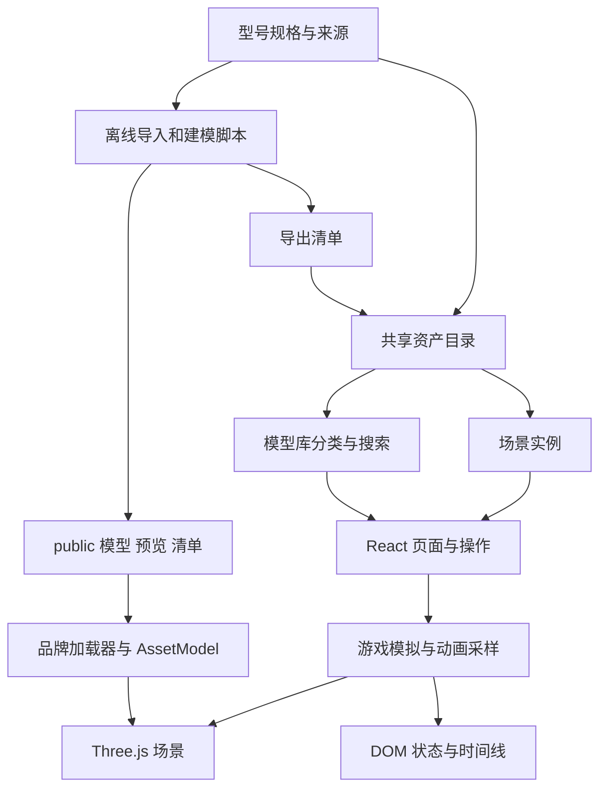

# 架构说明

[文档总览](README.md) · [设计理念](design/overview.md) · [开发指南](DEVELOPMENT.md)

核对日期：2026-09-07。应用是 Vite 构建的 React / TypeScript 静态前端，三维渲染使用 Three.js、React Three Fiber 与 Drei。没有服务端 API、数据库、账户或云端任务队列。

## 三层职责



**制作层**生成交付文件，不在浏览器中运行大规模建模或 USDZ 转换。**数据层**给模型稳定身份、分类、来源与实例变换。**交互层**组合界面、三维加载器和独立模拟；玩法中的高频更新不通过 React 的逐帧组件重建实现。

## 代码地图

| 模块 | 责任与入口 |
| --- | --- |
| [src/main.tsx](../src/main.tsx)、[App.tsx](../src/App.tsx) | 挂载、导航、模型筛选、选择集合、场景新增实例、提示与页面标题 |
| [data/catalog.ts](../src/data/catalog.ts) | `AssetId`、`ModelAsset`、基础场景、游戏引用、实例创建与保存 |
| [data/model-library.ts](../src/data/model-library.ts) | 品牌 / 类型 / 来源、别名搜索、推荐顺序、筛选地址序列化 |
| [pages/ModelLibrary.tsx](../src/pages/ModelLibrary.tsx) | 统一模型库、结果、卡片、多选与返回焦点 |
| [pages/Workspaces.tsx](../src/pages/Workspaces.tsx) | 模型 / 场景详情，共同操作与品牌专属说明 |
| [pages/Libraries.tsx](../src/pages/Libraries.tsx) | 场景库与游戏库 |
| [components/Models.tsx](../src/components/Models.tsx) | `AssetModel` 分派；四种基础原创网格 |
| [components/StudioCanvas.tsx](../src/components/StudioCanvas.tsx) | 模型和基地画布、镜头、灯光、就绪标记与错误边界 |
| [components/Interface.tsx](../src/components/Interface.tsx) | 导航视觉、按钮、选择框和查看工具栏 |
| [components/VisiblePreview.tsx](../src/components/VisiblePreview.tsx) | 接近视口才挂载实时预览，离开后卸载 |
| `src/apple/`、`dji/`、`nvidia/`、`tesla/`、`consoles/` | 品牌规格、来源、模型加载、详情、建模源与资产检查 |
| [spacecraft/build.ts](../src/spacecraft/build.ts)、[SpacecraftModel.tsx](../src/spacecraft/SpacecraftModel.tsx) | 航天几何生成及运行时级段、发动机、关节处理 |
| [pages/Animations.tsx](../src/pages/Animations.tsx)、`src/animation/` | 两套回收的动画库、播放器、采样、镜头与场地 |
| [game/simulation.ts](../src/game/simulation.ts)、[FlightGame.tsx](../src/pages/FlightGame.tsx) | 射击模拟、React 菜单 / HUD / 输入；三维场景和 Web Audio 分在同目录 |
| [racing/race.ts](../src/racing/race.ts)、[RacingGame.tsx](../src/pages/RacingGame.tsx) | 赛车物理、AI、圈数；输入 / HUD / 成绩；赛道、碰撞、音频与车辆分文件 |
| [scripts](../scripts) | 服务启动、模型导入 / 导出、预览和电影渲染、完整玩法模拟 |
| [public](../public) | 网站随包交付的 GLB、图片、清单和 Draco 解码器 |

早期 `AppleCollection`、`DjiCollection`、`NvidiaCollection` 等文件仍在目录中；当前主库入口是 `ModelLibrary.tsx`，不要只修改旧收藏页而误以为统一库已经更新。DJI 的独立 `DjiCanvas` 仍被共同详情使用，用于构型和资源加载。

## 共享资产契约

`ModelAsset` 包含 `id`、中英文名称、描述、原有分类、`viewScale` 与 `sceneScale`。`LibraryModel` 在此之上补充 `brand`、`type`、`source`、`aliases`，以及可选的 `preview` / `download`。品牌判断与搜索索引集中在 `model-library.ts`，不要从页面标题猜分类。

新增类型化 ID 后，必须有对应的目录项、加载入口与有效交付文件或实时组件。`assetById` / `libraryModelById` 依赖 ID 唯一；同名产品的折叠状态使用构型，不能以重复 ID 注册多个卡片。

场景保存轻量引用，不复制整份几何：

```ts
interface SceneInstance {
  id: string
  assetId: AssetId
  position: [number, number, number]
  rotation: [number, number, number] // 弧度
  scale: number
}
```

基础 16 个实例保存在源码；新增实例由 `createInstances` 放到四列、三行的预设位置，最多 12 个。存储读取会校验已知资产、`added-` 前缀、有限的坐标和旋转、合法比例与数量。损坏或不可访问的存储回退为空新增集合，基础场景仍可使用。

坐标、原点和缩放规则见 [资产指南](ASSETS.md)。下载 GLB、查看器取景、品牌加载器的归一化、场景展示比例是不同环节；不要为了网页大小合适而改掉下载文件的单位。

## 路由与状态归属

路由由 `App.tsx` 读取 `location.hash`，没有引入路由框架或服务端 rewrite：

| 地址 | 页面 |
| --- | --- |
| `#models`、`#models/<AssetId>` | 模型库、模型详情 |
| `#scenes`、`#scenes/moonbase` | 场景库、发射基地 |
| `#animations`、`#animations/starship-recovery`、`#animations/falcon-heavy-recovery` | 动画库、两套回收 |
| `#games`、`#games/starflight`、`#games/azure-circuit` | 游戏库、两款游戏 |

未知详情回退到相应库，未知一级入口回到模型库。模型筛选放在 hash 内，例如 `#models?brand=nvidia&type=gpu&q=5090&sort=name`。参数为 `q`、`brand`、`type`、`source`、`sort`；默认项省略，非法枚举回退默认。筛选使用 `history.replaceState`，避免每个输入字符产生一个后退步骤；进入详情使用 hash 导航。

| 状态 | 所属位置 | 生命周期 |
| --- | --- | --- |
| 当前页面、模型筛选 / 排序 | 地址 + App 状态 | 地址可刷新、复制和分享 |
| 模型选择、列表滚动与上次卡片 | App 状态 / ref | 当前页面会话；不跨刷新保存 |
| 自动旋转、分级、详情构型 | 详情组件 | 退出详情后不作为作品设置保存 |
| 已加入场景的实例 | App 状态 + localStorage | 同一浏览器、同一站点来源 |
| 游戏 / 动画当前时刻 | 模拟对象 | 进入该体验期间；不是云端进度 |
| 游戏设置和记录 | 对应模块 + localStorage | 同一浏览器、同一站点来源 |

### 本机存储兼容性

| 键 | 内容 |
| --- | --- |
| `form-space.scene-additions.v1` | 发射基地新增实例 |
| `form-space.starflight.records.v2` | 射击前五条记录 |
| `form-space.starflight.preferences.v2` | 射击难度、声音、音乐和自动射击 |
| `form-space.racing-settings.v1` | 赛车、难度、声音和自动油门 |
| `form-space.racing-records.v1` | 按赛车 / 难度保存的有效完赛记录 |

`form-space` 是历史兼容前缀，不应仅因界面更名而改掉。修改结构需要考虑迁移或显式版本升级。localhost、局域网 IP、Preview 与 Production 的来源不同，因此不会共享记录。用户清理站点数据后记录会丢失；没有恢复服务。

## 渲染、模拟与资源生命周期

模型和场景通过 `AssetModel` 复用同一份 GLB / 组件。独立实例的变换与关节状态应隔离，不能修改共享缓存后让另一个查看器跟着分离。航天模型的重复发动机由 [instances.ts](../src/spacecraft/instances.ts) 实例化；表面显示增强在 [surfaces.ts](../src/spacecraft/surfaces.ts)，下载保留通用 PBR 材质。

模型查看器在非自动旋转时使用 `frameloop="demand"`，交互使画布重新渲染；实时预览用 IntersectionObserver 控制挂载。图片预览减少列表 WebGL 上下文数。像素比按画布上限限制，静态结构合并、重复结构实例化，动画关节保持可寻址。新加载器要明确缓存、克隆与销毁的资源所有权，避免卸载一个实例时销毁仍在使用的材质或纹理。

射击和赛车使用 120 Hz 固定模拟步长并限制异常长帧；输入由页面采集，Three.js 场景读模拟状态，DOM HUD 分别约每 100 ms / 80 ms 同步。暂停冻结模拟，后台切换清理输入并暂停。玩法平衡与碰撞可在无 WebGL 的测试中验证，最终画面和输入方向仍要在浏览器验证。

回收动画按绝对时间采样位置、姿态、发动机、关节和镜头。回退时间后重建对应状态，避免只有顺序播放才正确的累积动画。Falcon Heavy 实时与视频导出共用 `mission.ts`、`world.ts`、`Canvas.tsx`；详情见 [动画与视频](ANIMATIONS.md)。只有动画路由当前使用 React `lazy` 延迟加载，不能将所有功能都描述为已按路由拆包。

## 错误处理与运行边界

`CanvasBoundary` 对三维启动失败显示可读说明和重新加载入口；渲染就绪标记供界面与验证脚本等待，不能代替画面检查。搜索无结果、场景空间满额和部分加入都有具体反馈。localStorage 失败不阻止游戏或场景继续运行。

浏览器运行资源来自本地静态路径，没有产品 CDN 运行依赖；外部来源链接由用户主动打开。没有 Service Worker 或离线安装流程，因此“资产随包交付”不等于已经提供离线 PWA。

当前构建把 Three.js 相关依赖单独分组，具体规则见 [vite.config.ts](../vite.config.ts)。`dist/` 是构建结果，`public/` 中的已导出文件是构建输入。MP4 位于被忽略的 `output/videos/`，不属于构建输入；Vercel 不会替开发者自动运行 Blender 或重录视频。
