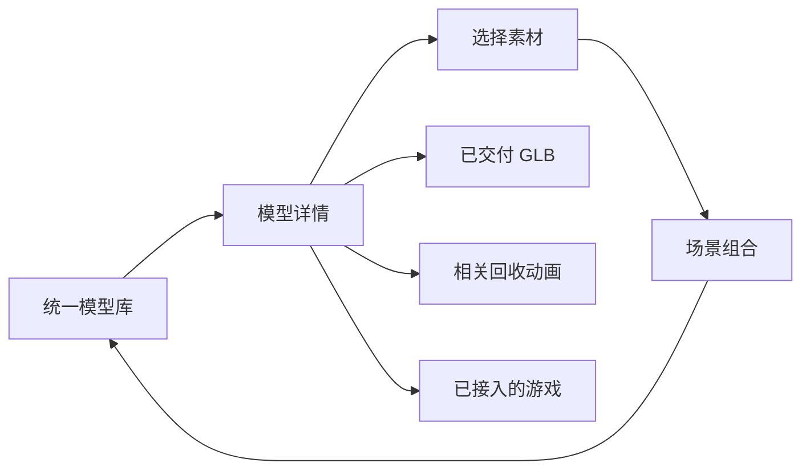

# 设计理念与产品规范

[文档总览](../README.md) · [使用指南](../USER_GUIDE.md) · [架构说明](../ARCHITECTURE.md)

更新日期：2026-09-07。本文是当前产品的设计基线；早期概念图保存在 [历史设计记录](spec.md)。下文的“后续方向”是建议，其他章节描述已经落地的结构或继续维护它时应遵循的原则。

## 产品要解决什么

**让模型容易被找到，让同一份模型真正被使用。** 用户既可能知道准确型号，也可能只记得品牌、中文俗称或产品类型。找到后应能直接看清结构、选择素材并继续组合或体验，不需要重新寻找入口。

3D Studio 的核心单位是一份可复用的三维资产。模型页负责认识它，场景负责建立空间关系，动画负责展示变化过程，游戏负责实际交互。四个入口服务不同意图，共享模型身份和来源。

| 用户意图 | 需要完成的任务 | 设计回应 |
| --- | --- | --- |
| “我要找 4090 / 重型猎鹰” | 用不完全一致的名称定位一个模型 | 搜索中文、英文、编号与显式别名 |
| “有哪些电脑 / 无人机” | 在同类模型中浏览与筛选 | 类型独立于品牌，可组合筛选 |
| “看看底部、折叠后、内部级段” | 接近并观察结构 | 统一查看器，加分级、构型和预设观察位置 |
| “把这些放在一起” | 跨品牌选择并加入基地 | 全局选择、统一资产标识、场景实例复用 |
| “两个助推器怎样分别落地” | 连贯地看过程，也能停下检查 | 可回退时间线、阶段、专属镜头与实时状态 |
| “试试这辆赛车” | 从模型进入可操作的玩法 | 只有已接入玩法的资产显示相应入口 |

## 核心原则及其取舍

### 1. 先帮助用户找到模型

模型库默认展示全部模型，顶部集中搜索、品牌、类型和来源筛选，再显示结果数量、排序与卡片。品牌是检索维度，类型是另一个维度；不为每个品牌建立一套不同的首页操作。

例如「电脑」同时匹配 Mac 和 DGX Spark；「DJI + 无人机」缩小到大疆飞行器；「游戏主机」同时展示 Xbox 与 PS5。`NV72` 是 NVL72 的检索别名，不另建一个重复型号。单字母变体必须区分，例如 Series X 与 Series S。

大幅品牌叙事不占据统一库的默认首屏。统一预览比例、标题和元信息，使新增品牌扩充内容而不改变寻找方式。推荐顺序是显式编排，不代表销量、技术性能或个性化推荐。

### 2. 统一常用动作，保留结构差异

每张卡片提供品牌、类型、名称、来源、选择状态和查看入口。详情保持大画布与信息 / 操作侧栏，选择、加入场景和可用的下载位于固定区域。

航天模型增加全貌、上面级、发动机与分级展开；DJI 多构型在同一模型详情切换。它们沿用共同布局，不要求用户重新学习一整套页面。缺少交付文件的实时模型不显示下载按钮；未接入游戏的产品不显示试玩入口。

### 3. 保留任务上下文

筛选与排序写入 hash 地址，可以刷新和分享。进入详情再返回，在当前页面会话恢复列表、滚动与上次卡片的焦点。切换筛选不清除已选模型；加入场景后清空本轮选择，并明确报告实际加入数量。

选择集合和滚动记录不承诺跨刷新保存。已加入场景的实例与游戏记录另用浏览器本机存储。将这些状态分开，避免把临时浏览动作误解为已保存作品。

### 4. 三维内容承担展示，原生界面承担操作

模型是可旋转的网格，动画是确定性采样的三维场景，游戏的舰体、子弹与赛车是实时对象。预览图来自实际交付模型。按钮、文字、表单、状态与字幕界面使用 HTML；设计参考图不代替运行界面。

这样既保留真实空间关系，也允许键盘操作、清晰文字和可测试状态。实时播放器提供镜头选择、阶段检查与慢速回放。MP4 属于本地制作输出，网站的观看流程不依赖预渲染视频文件。

### 5. 来源和精度与名称同样重要

卡片和详情区分「官网展示」「外观重建」「原创设计」。官方展示模型的来源不等于开放许可；公开尺寸不等于全部细节经测量。外观重建和轨迹近似需要在相关详情中解释，而不是把面数作为准确度证明。

下载 GLB 的坐标单位、展示缩放与动画构型分别记录。例如静态星舰库采用 124 m 组合，回收演示按参考飞行调整级段比例。它们复用建模，但不能混称为同一工程构型。

### 6. 先完成可用的闭环，再扩充能力

已有模型需要能查到、加载、观察、选择与加入场景；提供下载时文件必须存在。已有动画需要暂停、回退与重播都正确；游戏需要开始、实际操作、暂停、结算和返回。

目前场景采用预设位置，降低操作与维护复杂度；游戏是本地单人；资产制作由开发工具完成。AI 生成、账户和云端作品不是当前能力，不能用占位按钮制造已经接入的印象。

## 信息架构

图中动画、游戏与下载连接只出现在支持它们的模型上，不是所有模型的通用转换能力。

| 一级入口 | 列表的职责 | 详情的职责 |
| --- | --- | --- |
| 模型 | 搜索和比较，管理本次选择 | 查看、了解来源、专属结构操作、继续使用 |
| 场景 | 选择已有空间 | 环绕观察、添加实例、撤销 / 清空新增 |
| 动画 | 选择完整过程，了解主题 | 播放、阶段、镜头、时间线与参考 |
| 游戏 | 选择玩法，了解使用的模型 | 准备、操作、暂停、结算、再次开始 |

所有库和详情使用同一顶部导航与返回逻辑。非法详情标识退回对应库；地址规则见 [架构说明](../ARCHITECTURE.md)。

## 视觉语言

界面像一个安静的三维展台：深色背景减弱周边干扰，明暗与材质区分模型结构，黄绿强调色指出主要动作。SpaceX、Apple 或 Tesla 使用自身模型造型建立辨识度，外围界面仍属于同一个工作室。

### 颜色与字体

以下为 [src/styles.css](../../src/styles.css) 中的公共变量，新增页面优先复用，领域内可按可读性增加局部色彩。

| 变量 | 色值 | 用途 |
| --- | --- | --- |
| `--bg` | `#0b1014` | 页面背景 |
| `--surface` | `#0d1318` | 展示面 |
| `--text` | `#eff0e9` | 主要文字 |
| `--muted` | `#929d9f` | 辅助说明 |
| `--line` | `#293237` | 分隔与边框 |
| `--lime` | `#d0ed87` | 主操作、选中与键盘焦点 |
| `--soft` | `#bdc6bb` | 柔和文字 / 补充信息 |
| `--orange` | `#d27547` | 原创模型与局部暖色点缀 |

英文字体使用本地 Inter Variable，中文采用苹方 / 微软雅黑等系统字体。中文负责说明与操作，英文用于品牌、型号和目录识别。数值仪表使用稳定宽度，单位与数字一起出现。图标采用 Lucide 线性图标；只放图标的操作仍需可访问名称。

### 布局与层级

模型库从大屏四列逐步收为三列、两列，480 px 及以下一列；普通卡片预览为 4:3，窄屏单列为 16:9。统一比例不代表模型的物理尺寸相同，取景必须让轮廓完整。

详情大屏左侧画布、右侧说明，900 px 及以下画布在上、说明在下。手机不简单缩小桌面侧栏；应保证主要操作可触达、说明可滚动，顶部导航不会挤掉内容。实际断点与规则分别见 [模型库样式](../../src/model-library.css) 和各领域 CSS。

游戏可以使用鲜明的海岸或太空环境，持续 HUD 则避开驾驶路线与弹幕核心区域。动画镜头需要同时交代对象与目的地：双芯下降段看得清箭体，接地段看得见两座落地平台及完整火箭。

### 文案与反馈

操作使用具体动词，例如「加入发射基地」「下载当前构型 GLB」「撤销上一个」。来源、大小、阶段和数量来自实际数据。空结果提供清除筛选；场景满额显示原因；三维初始化失败提供重新加载；暂停、结束和接地状态有文字可读。

同一事实只在需要判断的地方展开。型号详情可以解释近似精度，开发工具路径和导出配置留在开发文档，不进入普通使用流程。

## 交互与可访问性

已实现跳到主要内容、导航当前位置、选择按钮状态、工具栏键盘操作、明确的焦点描边和输入标签。筛选结果数量通过状态区域反馈；来源既有颜色也有文字。动画快捷键避开已经聚焦的原生输入控件，后台自动暂停；音频由用户操作后初始化。

`prefers-reduced-motion` 会取消界面过渡及部分非必要游戏抖动，不等于停止所有 Three.js 运动。模型自动环绕和动画播放由用户控制。三维内容仍有视觉依赖；项目尚未完成完整读屏等价体验或 WCAG 全项审计，不能将现有语义标记表述为已经获得无障碍认证。

维护时在桌面、390 px 和 320 px 检查焦点、长型号名、按钮间距、无结果、加载失败和实际画面。不能仅凭 DOM 中有按钮认定触屏体验完成。

## 性能也是设计约束

卡片有预览图时优先显示图片；没有图片时只在接近视口处挂载三维预览。静态查看器按需渲染，动画暂停后按需更新；高频模拟独立于 React，HUD 降频同步。重复结构采用实例化、静态几何按材质合并，但可动关节保留层级。

这些取舍支持越来越大的模型库，同时保留可观察的细节。它们不是所有设备的帧率保证；新模型还需通过实际手机 / 桌面画面与文件预算检查，详见 [资产指南](../ASSETS.md) 和 [测试指南](../TESTING.md)。

## 后续方向与评估方式

以下仅为后续候选，尚未实现：品牌专题页、收藏与对比、场景自由移动 / 旋转 / 缩放、更多动画、通用导出、云端作品或多人。是否开展取决于实际需求；新增能力应先定义完整流程、数据保存与失败恢复，再增加入口。

评估统一设计时关注“能否找到”和“能否继续使用”：典型别名搜索是否命中、跨品牌筛选是否正确、从详情返回是否保留上下文、首次三维画面是否完整、下载与当前构型是否一致、场景实例是否复用原资产。当前没有线上行为统计系统，这些是人工 / 自动验收问题，不是已测得的转化率。
